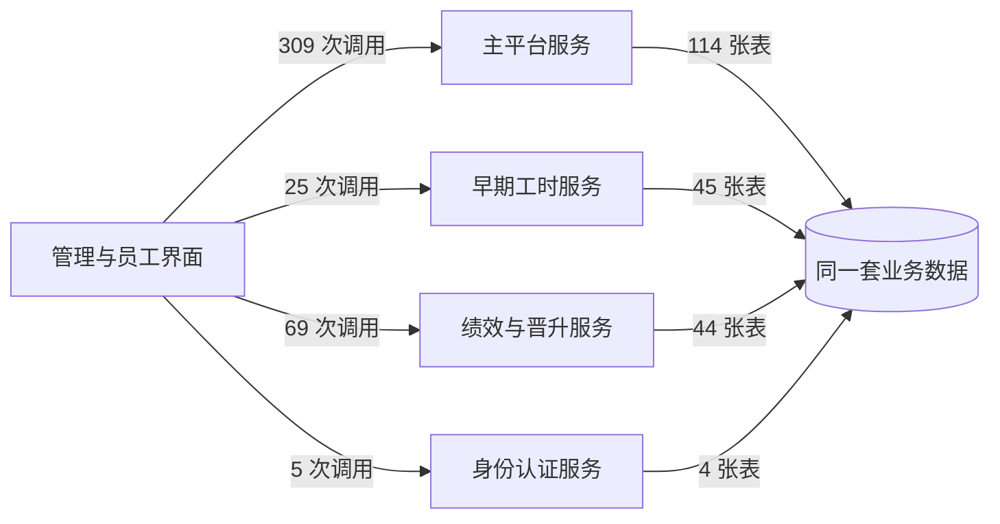
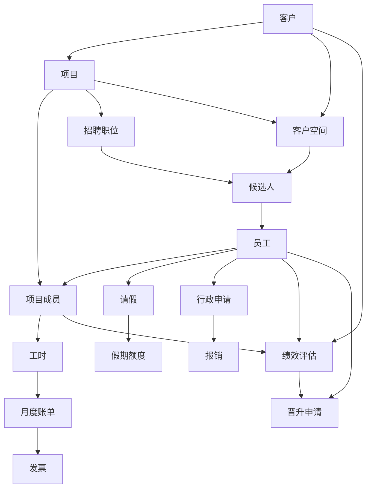
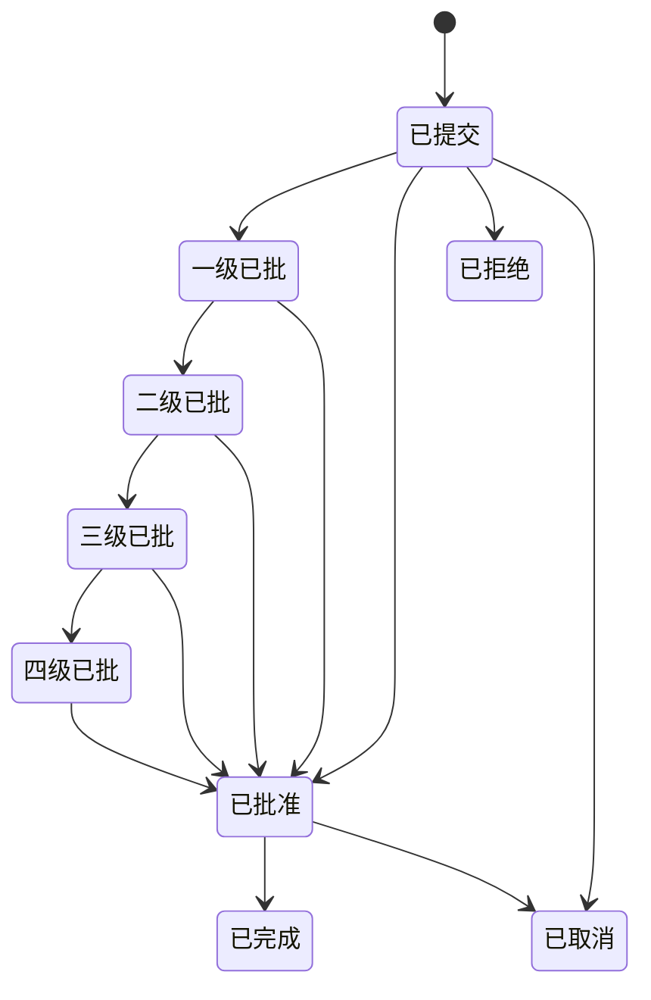
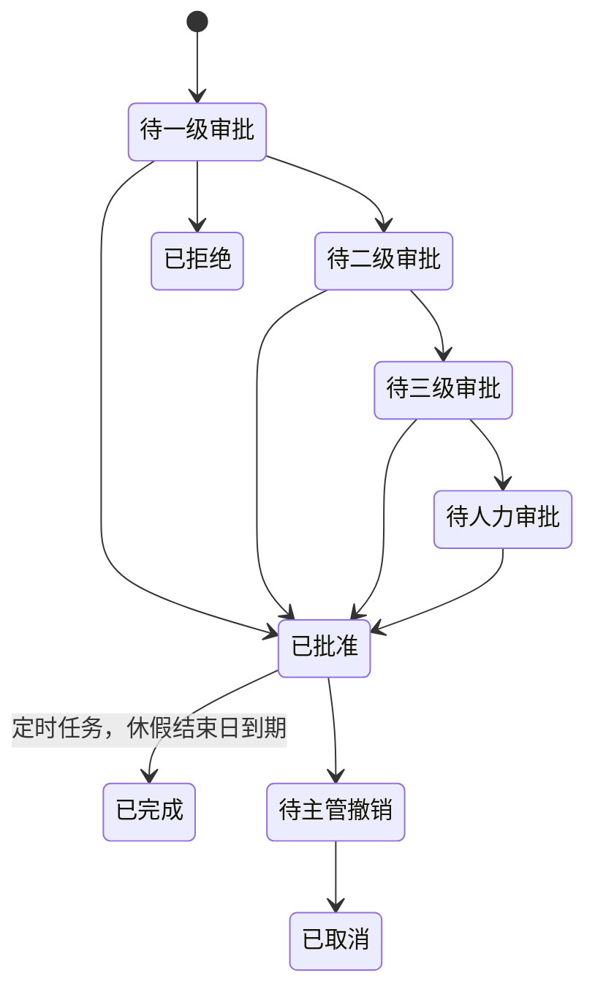
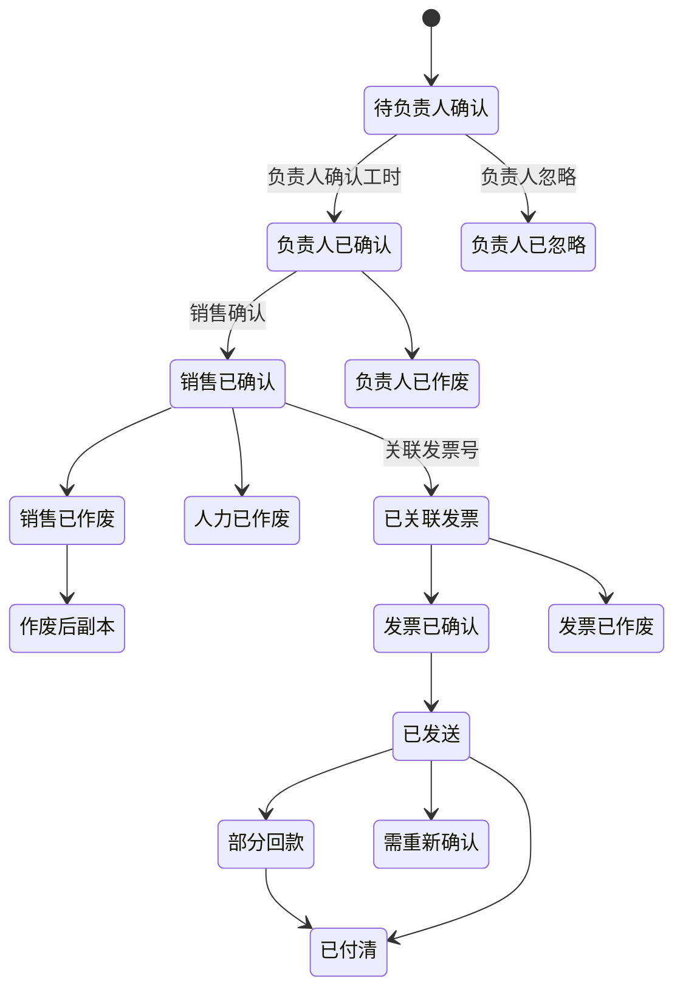
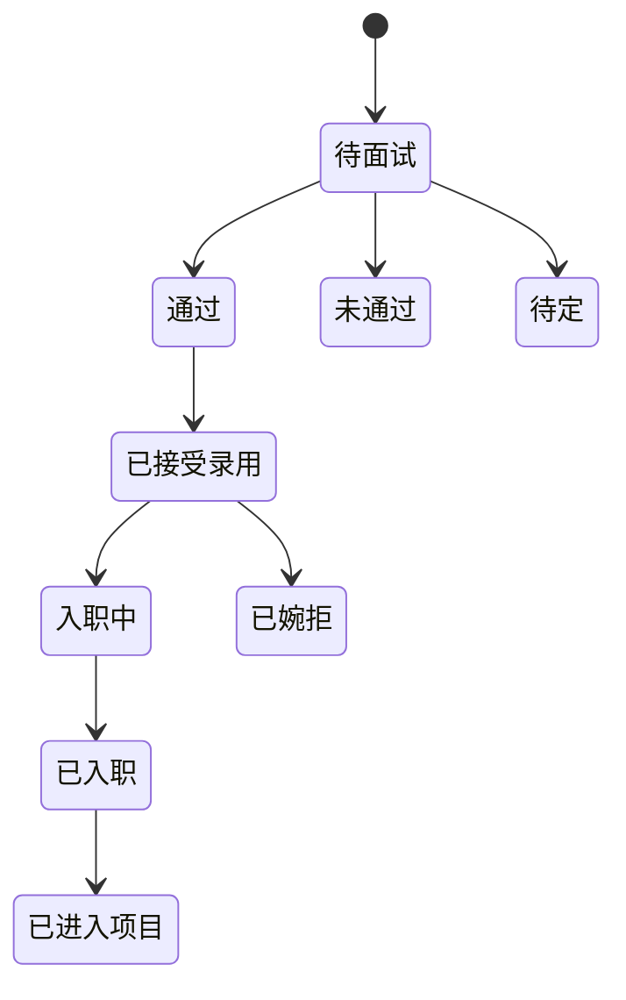
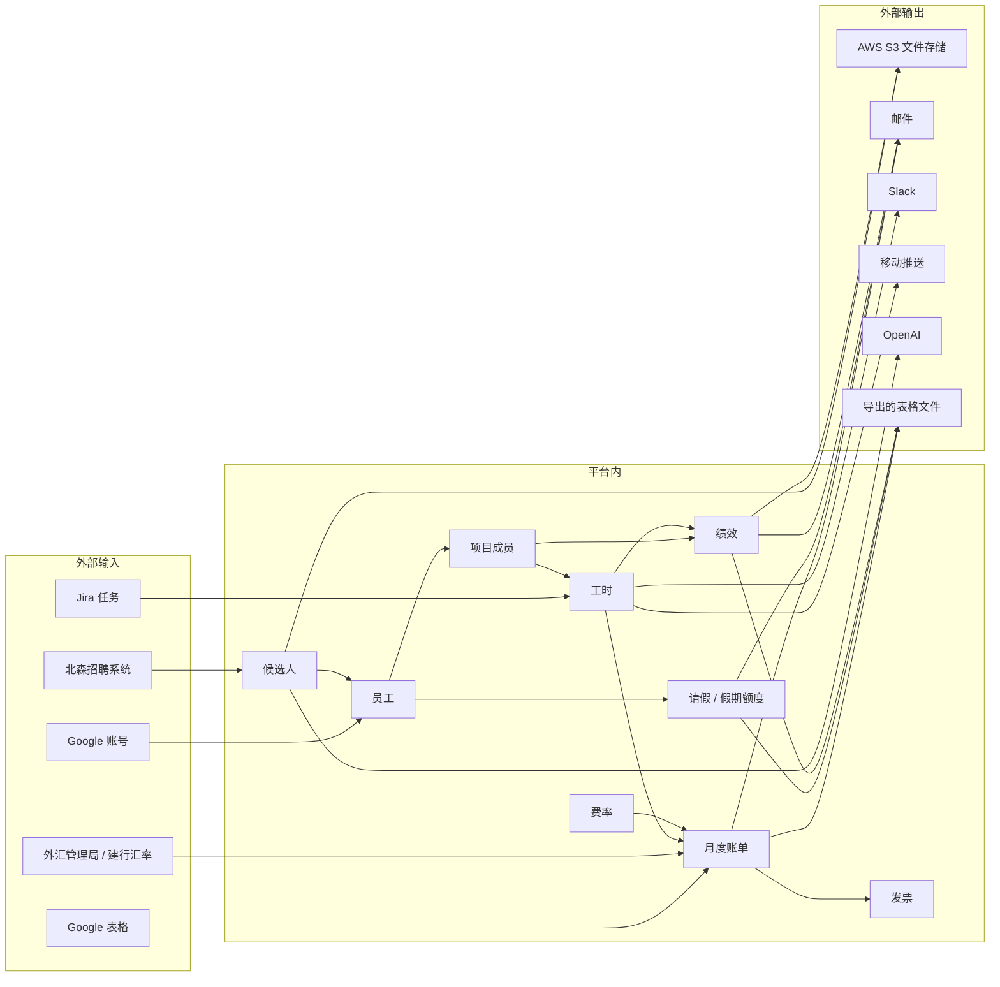

# WCP 项目概览（非技术）

## 开篇声明

**分析范围**：一次快照，读取了同一工作区下的五个源码仓库——员工与管理界面（wcp-ui）、主平台服务（wcp-service-v2）、绩效与晋升服务（wcp_review_service）、早期工时服务（wcp-service）、身份认证服务（wcp-auth）。共 2128 个文件，其中 2114 个被读取，14 个因属于版本控制内部文件、编辑器元数据或依赖目录而未读。

**分析方式**：只做了静态源码审阅。未安装依赖、未启动服务、未连接数据库、未执行测试、未追踪线上流量。因此本报告能说明"代码里写了什么"，不能说明"线上实际发生了什么"。

**结论等级**：

| 标记 | 含义 |
|---|---|
| `事实` | 由源码直接支撑，每条可追溯到文件与行 |
| `推断` | 基于列出的事实推理得出，依据可核对、结论不可核对 |
| `验证` | 先提出假设，再在事实库中检索后判定，附已检查的位置 |
| `不可得` | 静态源码给不出答案 |

**快照时间**：源码读取于 2026-08-03，五个仓库均取自各自的 master 分支。

<details>
<summary>快照的仓库版本</summary>

| 仓库 | 分支 | 提交 | 工作区是否有未提交改动 |
|---|---|---|---|
| wcp-service-v2 | master | 7db2ee8d2670993fe185d7293d6a315753602acd | 是 |
| wcp-ui | master | b86dfa27e95f2109dcd9bcbdec147b62dbc8312d | 否 |
| wcp-service | master | 9df6897542a15025dbda798f0c30d769c59c36ed | 是 |
| wcp_review_service | master | 272bbe725fe84d15973fff50b606184c88743fe6 | 是 |
| wcp-auth | master | 76e958d51b802c0a0619d11f21984fcf6ea6c895 | 是 |

快照标识 `run-20260803T002407Z-5ffd51`，生成于 2026-08-03T00:24:06Z。四个仓库在读取时含未提交的本地改动，报告描述的是这些改动之后的状态。
</details>

---

# 必读

## 1. 项目定位与边界

**这是一家技术服务公司（57Blocks）用来经营自己的一套内部业务系统：把"人"和"项目"连起来，再把两者一路算到客户账单上。** `推断`

它服务两类人。对内，全体员工在这里填工时、请假、报销、提各类行政申请、参加绩效评估、申请晋升；管理者在这里带团队、审批、看招聘进度、确认账单。对外，客户可以被邀请进一个只属于自己项目的空间，看候选人、看进展；还能被邀请为服务自己的员工填写评价。候选人则通过公开链接提交和维护自己的简历资料。

<details>
<summary>依据</summary>

- 绩效服务仓库的 README 自述："57Blocks Collaboration Platform — the back-end endpoint of 57blocks collaboration platform's review service. It's aimed at reviewing internal stuff's performance in a period of time or a specific project."（wcp_review_service/README.md）
- 早期工时服务 README 自述："Worklog Service API — This repository builds all the APIs mainly used for the worklog service."（wcp-service/README.md）
- 界面路由分为四个入口区：`/my/*`（本人事务）、`/manage/*`（管理与后台）、`/public/*`（对外公开页）、`/space/:projectName/:code/*`（客户项目空间）。共 182 条界面路由（wcp-ui）
- 核心业务对象：员工、项目、客户、工时、请假、假期额度、申请、报销、账单、发票、评估、晋升、职位、候选人（共 207 条数据表声明，去重后 160 张表）
</details>

**主要用户和客户** `事实` + `推断`

代码里定义了 11 种角色 `事实`，按其可访问的入口集合判断，最主要的是四类 `推断`：普通员工（自助事务）、项目/团队负责人（审批与团队管理）、人力资源（员工全生命周期）、销售与开票管理（客户、账单、发票）。外部使用者有两类：客户和候选人，他们不使用完整后台，只走公开链接和项目空间。

<details>
<summary>依据：角色定义（wcp-service-v2/internal/constant/role.go:6）</summary>

`EmployeeC=1/normal`、`AdminC=2/admin`、`ProjMngC=3/project_management`、`HRC=4/hr_specialist`、`ReviewAdminC=5/review_admin`、`ClientC=7/client`、`SaleC=11/sale`、`RateAdminC=14/rate_admin`、`OfficeManagementC=15/office_management`、`InvoiceManagerC=16/invoice_manager`、`SysAdminC=51/system_admin`。

登录令牌类型（同文件:42）：`Employee`、`Client`、`Candidate`、`Customer`、`ForgotPassword`——说明系统为员工、客户、候选人分别签发不同的凭证。
</details>

**核心使用场景** `推断`

1. 员工每周填工时并关联到 Jira 任务；到点系统发提醒。
2. 员工请假 / 提申请（用章、在家办公、出差、加班、采购）→ 逐级审批 → 假期额度扣减。
3. 员工报销（出差、加班、采购、其他）→ 审批 → 财务导出。
4. 月末：团队负责人确认工时账单 → 销售确认 → 关联发票 → 跟踪回款。
5. 周期性绩效评估：自评、同事评、主评人评、客户评，出最终结果。
6. 晋升季：员工申请 → 主管推荐 → 评审 → 结果。
7. 招聘：开职位 → 人才库/北森同步候选人 → 面试 → 入职 → 进项目。
8. 客户在专属空间里看候选人和项目进展。

**产品提供的核心价值** `推断`：把"谁在做什么项目、做了多久、值多少钱、做得好不好"这四件事放进同一套数据里，从而让工时可以直接变成客户账单，让项目参与情况可以直接变成绩效与晋升的依据。

**项目边界：什么在项目内** `事实`

员工档案与个人信息、组织（办公室/地点/时区）、职位与职级、技能、项目与客户、项目成员与计划、工时、请假与假期额度、五类行政申请、四类报销、账单与发票与汇率、绩效评估、晋升、招聘职位与候选人、公司政策与阅读确认、内部通讯、AI 工具目录、身份认证与授权。

**外部系统边界：什么由外部提供** `事实`

登录身份（Google 账号）、任务系统（Jira）、招聘系统（北森）、文件存储与邮件发送（AWS S3 / SES）、即时消息（Slack）、移动推送（腾讯 TPNS）、大模型（OpenAI）、表格数据（Google Sheets）、地址补全（Google Maps）、汇率（国家外汇管理局、建设银行页面）、文档转图（api2pdf）。

**项目当前阶段** `不可得`。源码不记录上线时间、用户规模、商业状态。可观察到的只是：早期工时服务与主平台服务并存且功能重叠，主平台服务承担了绝大部分流量入口——这是"迁移进行中"的形态，但迁移是否仍在推进，静态源码无法判定。

### 所以呢

这不是一个单一功能的工具，而是一家公司的经营中枢：**工时数据同时决定员工的假期、客户的账单和自己的绩效**。任何影响工时或项目成员关系的改动，都会同时影响钱、假和考核三条线。因此后文所有的风险，凡是落在"工时—项目成员—账单"这条链路上的，优先级都应该比它表面看起来更高。

---

## 2. 系统与仓库组成

| 系统 | 主要用途 | 使用对象 | 承载能力 | 备注 |
|---|---|---|---|---|
| **管理与员工界面** | 全部人机交互的唯一入口 | 员工、管理者、HR、销售、财务、客户、候选人 | 182 个界面入口，覆盖个人事务、管理后台、公开页、客户空间 | 唯一前端，同时对接下面四个后端 |
| **主平台服务** | 平台主体：人事、项目、客户、申请、请假、报销、账单、招聘、政策 | 前端；对外接第三方 | 340 个接口，114 张数据表 | 承载 76% 的前端调用，是事实上的主服务 |
| **绩效与晋升服务** | 绩效评估、晋升评审、客户评价邀请 | 前端；被邀请的客户 | 93 个接口，44 张数据表 | 独立部署，功能边界清晰 |
| **早期工时服务** | 工时录入与查询、Jira 服务器配置、日报、部分报表、多项定时任务 | 前端 | 91 个接口，45 张数据表 | 请假、假期、项目、用户能力与主平台服务重复，但仍在被调用 |
| **身份认证服务** | 登录、令牌签发与刷新、授权同意页、客户激活 | 前端；作为标准身份提供方 | 15 个接口，4 张数据表 | 提供标准 OAuth2 授权服务器元数据 |

**是否有活跃入口、是否被其他仓库调用** `事实`：前端向主平台服务发出 309 次调用、向绩效服务 69 次、向早期工时服务 25 次、向身份认证服务 5 次。四个后端之间没有观察到相互调用，也没有循环依赖。

**早期工时服务是否为历史或待废弃系统** `验证`

结论：**它承担的业务已被主平台服务大面积覆盖，但它没有下线，而且仍在独立写库和跑定时任务。**

- 它的请假、假期、项目、用户接口中，共 25 个未被前端调用，其中 `/leaves` 系列 14 个、`/holidays` 系列 11 个几乎全数无人调用 `事实`
- 同时，前端仍然实实在在地调用它 25 个接口，集中在工时录入、Jira 服务器配置、日报、职位/技能字典 `事实`
- 它仍在运行 5 个具名定时任务：请假邮件、请假完结标记、次年假期额度初始化、周工时提醒、绩效通知邮件 `事实`
- 它与主平台服务同时向请假、假期额度、审批、用户、项目成员五张表写入 `事实`

<details>
<summary>依据</summary>

- 前端调用早期工时服务的 25 个端点：工时增删改查（`/worklogs*`，共 11 个）、Jira 服务器（`/jira/server*`，5 个）、日报（`/log_report/daily`）、项目动态（`POST /projects/feed`）、个人档案与字典（`/users/profile`、`/users/job-titles`、`/users/skills`）
- 无人调用的端点样例：`GET /leaves`、`GET /leaves/:id`、`GET /leaves/leave/statuses`、`GET /leaves/leave/types`、`GET /holidays`、`GET /holidays/:id`、`GET /holidays/holiday/changes`、`GET /holidays/holiday/types`
- 定时任务：`common/scheduleService.js` 中 `Check-Mail`(:18)、`Check-Leave-Done`(:89)、`Create-Next-Year-Holiday-Hour`(:97)、`Check-weekly-worklog`(:106)、`Send-Performance-notice-email`(:123)
- 双写表：`wcp_approve`、`wcp_holiday_hour`、`wcp_leave`、`wcp_leave_detail`、`wcp_project_member`、`wcp_user`
</details>

### 所以呢

**这是一套"四个后端 + 一个前端"的系统，但真正的结构事实是：新旧两代后端同时在世，且不是干净的前后关系。** 早期工时服务不是一个可以随手关掉的遗留物——它握着工时录入这个上游入口，还在定时改假期额度和请假状态。任何"下线旧服务"的计划，都必须先把工时录入和这 5 个定时任务搬走，而不能只看接口调用数。

反过来，前端是全系统唯一的界面，它的可用性等于整个平台的可用性；四个后端里任何一个不可用，前端都会缺掉一块，但不会整体瘫痪。

---

## 3. 业务域与功能地图

```text
WCP
├── 个人自助
│   ├── 工时          填报（单日/多日）、查看、修改、删除、剩余工时提示、Jira 任务关联
│   ├── 请假          申请、取消、明细、余额；10 种假期类型
│   ├── 行政申请      用章、在家办公、出差、加班、采购
│   ├── 报销          出差、加班、采购、其他
│   ├── 个人信息      档案、个人资料、银行与紧急联系人（编辑流程当前被临时关闭）
│   └── 面试          我的面试、候选人/员工/外部人选画像
├── 审批
│   ├── 请假审批      L1/L2/L3/HR 四级流程、余额、历史
│   ├── 申请审批      列表、明细
│   ├── 报销审批      列表、明细
│   └── 客户承担费用  申请、账单、报销三种来源的合并审批
├── 项目与客户
│   ├── 项目          创建、编辑、归档、成员、计划、动态、点赞、成就
│   ├── 客户          创建、编辑、归档、付款条件、销售归属
│   ├── 客户空间      专属空间、口令、有效期、权限（评价/受限）、候选人看板、招聘看板
│   ├── 提案          创建、公开链接、口令保护、Google 表格导入
│   └── Jira 集成    服务器配置、连通性测试、任务选择、项目关联
├── 计费
│   ├── 月度账单      生成、负责人确认、销售确认、作废、手工账单、折扣、现金/股权比例
│   ├── 发票          关联/解关联、金额差异提醒、已发送/部分回款/已付清、未付催收
│   ├── 费率          员工费率、项目费率、年度费率同步
│   └── 汇率          多币种、每日汇率抓取
├── 人力资源
│   ├── 员工          档案、状态、雇佣类型、职级、职位、技能、经历、待入职
│   ├── 招聘          职位、招聘看板、面试进度、面试官
│   ├── 人才库        候选人、外部人选、筛选、分享链接、AI 生成画像
│   └── 假期额度      年度额度、增减记录、次年初始化、拉美地区额度上限提醒
├── 绩效与晋升
│   ├── 绩效评估      自评、同事评、主评人评、行政管理、四轮提醒、最终结果、一对一
│   ├── 客户评价      邀请客户、分享链接、有效期、汇总
│   └── 晋升          申请、主管推荐、初评、终评、发布
├── 公司治理
│   ├── 政策          发布、草稿、归档、阅读确认、催办、水印 PDF、中英双语
│   ├── 内部通讯      创建、发布
│   └── AI 工具目录  登记、评分、评论、团队归属
└── 平台能力
    ├── 身份认证      OAuth2 授权码、令牌刷新、Google 登录、授权同意、客户激活
    ├── 开放接口      面向 AI 助手的工时/项目接口与令牌管理
    ├── 通知          邮件（96 个模板）、Slack 消息、移动推送
    └── 定时任务      12 处注册点，含请假完结、分享过期、AI 超时、账单催办、工时提醒
```

### 功能状态

| 状态 | 判定 | 数量 | 说明 |
|---|---|---|---|
| 有入口且可达 | 前端调用能对上服务端路由，且能追进处理函数 | 404 个服务端接口 | 占 539 个接口的 75% |
| 有代码但无入口 | 工作区内找不到任何调用 | 135 个服务端接口 | 详见第 9.3 章 |
| 显式标记废弃或未完成 | 代码注释明确标注 | 至少 8 处 | 见下 |
| 受开关门控 | 配置开关包裹 | 2 处 | 周工时提醒开关、旧工时数据结构兼容开关 |
| 待确认 | 以上均不成立 | — | — |

<details>
<summary>显式标记废弃或未完成的位置</summary>

- `wcp-ui/src/pages/personal-information/PersonalInformation.tsx:119, :162, :353` 与 `components/PersonalInformationView.tsx:21`、`components/BasicInfoView.tsx:30` —— "TODO: temporarily disable edit flow"（个人信息编辑流程被临时关闭）
- `wcp-ui/src/pages/admin/components/EditLastWorkDayModal.tsx:204` —— "Disabled: Dialog 4 … Backend preview no longer returns contract_type_effective_date, so this dialog…"（后端不再返回该字段，对话框被停用）
- `wcp-ui/src/pages/billing/components/RevenueAnalyticsTableEmptyBody.tsx:38, :43` 与 `revenue-analytics-types.ts:67` —— `@deprecated`
- `wcp-service/routes/v2/worklog.js:13` —— "(TODO): Not used anywhere. Can be deleted!?"
- `wcp_review_service/internal/handler/promotion/promotion_state.go:573` —— "Send Results TODO: send results operation"（晋升结果发送未实现）
- `wcp_review_service/internal/review/employee/employee_resource.go:50` —— `tempFunc` 返回 "Empty Func, pls replace it"
- 开关：`IS_CLOSE_WEEK_WORKLOG_REMINDER`、`KEEP_OLD_WORKLOG_DATA_STRUCTURE`（wcp-service/.env.sample）
</details>

<details>
<summary>功能来源覆盖情况</summary>

| 来源 | 是否覆盖 | 证据 |
|---|---|---|
| 用户端页面 / 管理后台 | 是 | 182 条界面路由 |
| 移动端 | 未发现独立移动端仓库；发现移动推送调用 | `internal/handlers/notification/concrete.go:64,:112` 调用腾讯 TPNS |
| API 能力 | 是 | 539 个服务端接口，三个仓库暴露接口文档端点 |
| 数据导入导出 | 是 | 9 个导出端点、6 个上传下载端点 |
| 消息通知 | 是 | 96 个通知模板、6 处聊天消息发送、2 处移动推送 |
| 第三方集成 | 是 | 见第 7 章 |
| 定时任务 | 是 | 12 个注册点 |
</details>

### 模块之间的关系



**哪些模块相互调用** `事实`：四个后端之间没有任何直接调用。它们之间**唯一的连接是共用一套数据库**。前端是唯一的调用发起方。

**哪些模块共享同一个业务对象** `事实`：

| 业务对象 | 被这些服务读写 |
|---|---|
| 员工 | 主平台（读写）、早期工时（读写）、绩效服务（读）、身份认证（读） |
| 项目 | 早期工时（写）、主平台（读）、绩效服务（读） |
| 项目成员 | 早期工时（写）、主平台（读写）、绩效服务（读） |
| 工时 | 早期工时（读写）、主平台（读）、绩效服务（读） |
| 请假 / 假期额度 | 早期工时（读写）、主平台（读写） |
| 审批记录 | 早期工时（写）、主平台（读写） |
| 项目负责人、主职位、用户角色 | 早期工时（写）、主平台与绩效服务（读） |

**哪些模块被最多其他模块依赖** `事实`：员工对象。四个服务全部读它，两个服务写它。项目与项目成员次之，三个服务读、两个服务写。

**哪些模块跨越多个仓库** `事实`：8 个——假期、请假、管理、身份授权、项目、支撑数据、临时分享、用户。

### 所以呢

**这套系统的服务边界是"接口上分开、数据上不分开"。** 四个后端不互相调用，看起来解耦得很干净；但它们同时读写同一批表，其中最核心的员工、项目、项目成员、请假、假期额度五组数据是共享的。这意味着：

- 一个服务改了数据的存法，另一个服务会直接受影响，中间没有任何接口挡着。
- 一条业务规则（比如"请假多少小时以上要主管批"）如果只在一个服务里补，另一个服务写进去的数据就绕过了它。第 9 章会给出这种分歧已经发生的实例。
- 想按服务拆团队、拆发布节奏是可行的；想按服务拆数据归属，目前做不到。

---

# 按需查

## 4. 角色、权限与组织

### 系统有哪些用户角色 `事实`

| 角色 | 主要职责（`推断`，依据：其可访问的入口集合与代码中的检查点） |
|---|---|
| 员工 | 填工时、请假、提申请、报销、参加绩效评估与晋升、查看个人档案 |
| 管理员 | 跨模块的管理权限，多处作为"绕过本人限制"的豁免条件出现 |
| 项目管理 | 项目、项目成员、工时审阅、团队账单 |
| 人力资源 | 员工全生命周期、候选人、面试、假期额度、职位 |
| 评估管理员 | 绩效评估的创建、分配、汇总、发布 |
| 客户 | 通过项目空间查看候选人与项目进展，参与客户评价 |
| 销售 | 客户、账单确认、发票、提案 |
| 费率管理 | 员工与项目费率 |
| 办公室管理 | 办公室、地点相关配置 |
| 开票管理 | 发票关联、回款状态 |
| 系统管理员 | 全局配置与最高权限 |

<details>
<summary>角色在代码中的编码</summary>

wcp-service-v2/internal/constant/role.go:6 —— 数值编码与字符串编码成对定义：1/normal、2/admin、3/project_management、4/hr_specialist、5/review_admin、7/client、11/sale、14/rate_admin、15/office_management、16/invoice_manager、51/system_admin。编号 6、8、9、10、12、13 未定义。
</details>

### 权限矩阵

**这一章的核心产出无法完整给出，原因必须说清楚。** `不可得`（部分 `事实`）

系统的权限检查分两层。第一层"是否登录"在路由上声明得非常整齐：539 个服务端接口中 495 个挂了认证中间件，44 个没有。第二层"这个角色能不能做这件事"，在路由上几乎不声明——只有 64 个接口在注册时带了角色或数据范围相关的中间件，其余全部把授权判断写在处理函数内部。静态分析读不到处理函数内部的角色判断，所以**"角色 × 模块 × 操作"的完整矩阵在源码的这一层是不存在的**，它没有被声明在任何一个可枚举的地方。

能给出的是路由层声明的那一部分：

| 声明位置 | 检查内容 | 接口数 |
|---|---|---|
| 主平台服务 | 仅认证 | 299 |
| 主平台服务 | 客户空间认证 + 客户空间权限 | 9 |
| 主平台服务 | 认证 + 候选人筛选权限 | 8 |
| 主平台服务 | 认证 + 职位权限 | 5 |
| 主平台服务 | 临时分享令牌认证 | 2 |
| 绩效服务 | 认证 | 43 |
| 绩效服务 | 认证 + 授权 | 25 |
| 绩效服务 | 认证 + 管理员或负责人 | 13 |
| 绩效服务 | 认证 + 负责人 | 3 |
| 绩效服务 | 认证 + 管理员/负责人/主管 | 1 |
| 早期工时服务 | 参数校验 + 登录 | 51 |
| 早期工时服务 | 登录 | 26 |
| 早期工时服务 | 开放接口令牌 | 7 |
| 身份认证服务 | 无（本身即认证服务） | 15 |
| 无任何认证中间件 | — | 44 |

在处理函数内部能被静态识别到的角色判断，只是零星几处，可以作为"权限是怎么写的"的样本：

<details>
<summary>处理函数内部的权限判断样本</summary>

- 早期工时服务把角色判断集中在 `common/utilService.js`：`isAdmin`、`isHRSpecialist`、`isProjectManagement`、`isSystemAdmin` 四个判定，以及它们的组合（:17、:24、:31、:38、:49、:56、:63、:70、:80）
- 工时按项目查询：`!isAdmin(roles) && simpleProject.leader_id !== req.user.user_id` 才拒绝（`routes/worklogs.js:490`）——即管理员或项目负责人可看
- 工时本人限制：`log.user_id !== req.user.user_id` 拒绝（`routes/worklogs.js:144, :248, :296`）
- 绩效服务的数据权限判断形如 `cuID != uri.UserID && !CheckIsAdmin(...) && !CheckIsMROfUser(...) && !CheckIsManagerOfReview(...)`（`internal/review/admin_main/admin_main_resource.go:490, :701, :993`）
- 申请填写限制："You don't have permission to fill in this application." —— `applicationObj.ApplicantID != 当前用户`（`internal/handlers/application/general/service.go:1250`）
- 角色删除保护："Cannot delete the 'sale' role because he/she is the sale of %s client."（`internal/handlers/employee/service.go:968`）
</details>

### 数据访问范围 `事实`（局部）

代码中能确认的范围规则：工时默认只能看/改本人的，项目负责人和管理员可看本项目全员；绩效记录默认只能看本人的，评估管理员、主评人、评估负责人可看他人；客户空间按空间授权，且空间有权限等级（评价 / 受限）与有效期。**更完整的"本人 / 本部门 / 全公司"三级划分在源码中没有统一声明，无法枚举** `不可得`。

### 企业、租户、组织、部门之间的关系 `事实`

**系统不是多租户的**：没有租户字段，没有租户过滤。组织维度是这样的：

```text
公司（单一）
├── 办公室 ─── 时区
├── 地点 ────── 时区
├── 职位 ────── 职级
├── 客户 ────── 销售负责人、团队负责人、付款条件
│   └── 项目 ── 项目负责人、项目成员（含职级、费率、计划）
│       └── 客户空间 ── 口令、有效期、权限等级、被授权的客户邮箱
└── 员工 ────── 雇佣类型、主职位、职级、技能、办公室、地点
```

"部门"只有一张成员关系表存在于早期工时服务中，主平台服务没有部门概念——**组织的实际切分维度是办公室与地点，不是部门** `推断`（依据：主平台服务的员工表有办公室与地点字段并在业务判断中被使用，而部门表只在早期服务中出现且未见业务规则引用）。

### 所以呢

**权限在这个系统里是"写出来的"，不是"配出来的"。** 谁能做什么，散落在几百个处理函数内部，没有任何一处集中声明。这带来三个直接后果：

1. 任何"某某角色应该能/不能做某事"的问题，都只能靠人去读代码回答，不能靠查配置回答；上线前的权限评审无法自动化。
2. 新增一个角色，意味着要逐个函数去改，而不是加一行配置。11 个角色里编号不连续（6、8、9、10、12、13 空缺），说明历史上确实增删过角色。
3. 因为没有集中声明，一个漏写的判断不会被任何检查发现。第 9 章给出了一个已经发生的实例。

---

## 5. 核心业务对象与生命周期

### 核心业务对象与关系



| 业务对象 | 业务含义 `推断` | 由谁创建 `事实` | 由谁变更 `事实` |
|---|---|---|---|
| 员工 | 公司在册人员及其档案、职级、技能、经历 | 人力资源创建；候选人入职时由系统转入 | 人力资源、本人（部分字段）、系统 |
| 客户 | 付费方，带付款条件与销售归属 | 销售/管理员 | 销售/管理员；有重名校验与删除保护 |
| 项目 | 交付单元，分一般 / 售前 / 名义雇主三类 | 早期工时服务写入 | 早期工时服务与主平台服务 |
| 项目成员 | 员工在项目上的角色、职级、费率、投入计划 | 主平台服务与早期工时服务 | 同左；到期计划有自动清理任务 |
| 工时 | 员工按天按项目填报的小时数，可关联 Jira 任务 | 员工本人（经早期工时服务） | 本人；管理员与项目负责人可查阅 |
| 月度账单 | 一个项目一个月的应收，按工时 × 费率算出 | 系统按月生成，也可手工创建 | 团队负责人 → 销售 → 开票管理 |
| 发票 | 一张或多张账单合并后的对客账单 | 开票管理 | 开票管理 |
| 请假 | 一次休假申请及其审批链 | 员工本人 | 审批人；定时任务标记完结 |
| 假期额度 | 员工当年各类假期的可用小时数 | 系统按年初始化 | 请假消耗、人工增减（有变更日志） |
| 行政申请 | 用章 / 在家办公 / 出差 / 加班 / 采购五类审批 | 员工本人 | 逐级审批人 |
| 报销 | 出差 / 加班 / 采购 / 其他四类费用申请 | 员工本人 | 审批人；财务导出 |
| 绩效评估 | 一个周期内对一名员工的多方评价与最终结果 | 评估管理员 | 自评人、同事、主评人、评估管理员、客户 |
| 晋升申请 | 一次晋升的申请、推荐、评审、结果 | 员工本人 | 主管、评审人、管理员 |
| 招聘职位 | 项目上的用人需求 | 项目方/人力资源 | 人力资源 |
| 候选人 | 内部或外部人选及其面试进度 | 人力资源；北森同步；公开链接自助 | 人力资源；面试官 |
| 客户空间 | 一个项目对客户开放的窗口 | 项目方 | 项目方；有口令、有效期、权限等级 |

### 主要对象的状态流转 `事实`

**行政申请**



**请假**（九个状态，四条审批流：一级、二级、三级、人力资源；另有"主管申请撤销"这一条单独的流）



**月度账单与发票**



**候选人与入职**



### 哪些涉及资金、权限或敏感信息 `推断`

| 对象 | 敏感性 | 依据（字段命名、权限检查） |
|---|---|---|
| 员工个人信息 | **高**：银行账户、开户行、卡上姓名、通讯地址、紧急联系人电话、个人邮箱、生日 | 字段名直接可辨；该编辑流程当前被标注临时关闭 |
| 员工费率、项目费率 | **高**：直接对应人力成本与报价 | 有专门的"费率管理"角色 |
| 月度账单、发票、报销 | **高**：金额、折扣、现金/股权比例、回款状态 | 金额字段密集，且有多级确认与作废保护 |
| 候选人资料 | **高**：期望薪资、电话、邮箱、生日 | 字段名直接可辨；有公开分享链接 |
| 登录凭证 | **高**：密码、令牌、项目空间口令、提案口令 | 密码、令牌字段 |
| 假期额度 | 中：直接决定员工可休时长 | 有变更日志表 |
| 绩效结果、晋升记录 | 中：影响个人发展 | 有严格的可见性判断 |

### 所以呢

**这套对象模型的重心是"员工—项目成员—工时"这条主干，其余分支都挂在它上面。** 项目成员这条关系同时决定了：这个人的工时算给哪个项目、按什么费率进账单、绩效评估里由谁来评、晋升时看哪些项目经历。它是全系统耦合度最高的一条数据。

两点值得业务方注意：

1. **账单一旦确认，系统留了快照。** 确认时把工时小时数、请假小时数、费率、成本写进了确认日志表，另有账单快照表。这意味着事后改工时不会自动改掉已确认的账单——这是好事（账目可追溯），但也意味着**工时改了、账单不会自己更正**，需要人工介入。
2. **员工个人信息里含银行账户，而该编辑流程当前被标注临时关闭**。这块功能的状态需要跟业务方确认是有意为之还是遗留。

---

## 6. 数据全景与流转

### 核心数据与归属 `事实`

| 数据 | 写入方 | 读取方 |
|---|---|---|
| 员工档案 | 早期工时服务、主平台服务 | 四个服务全部 |
| 项目、项目负责人、主职位、用户角色 | 早期工时服务 | 主平台服务、绩效服务 |
| 项目成员 | 早期工时服务、主平台服务 | 绩效服务 |
| 工时 | 早期工时服务 | 主平台服务、绩效服务 |
| 请假、假期额度、审批 | 早期工时服务、主平台服务 | 双方 |
| 账单、发票、费率、汇率 | 主平台服务 | 主平台服务 |
| 报销、行政申请 | 主平台服务 | 主平台服务 |
| 绩效、晋升 | 绩效服务 | 绩效服务 |
| 客户 | 早期工时服务、身份认证服务 | 主平台服务 |
| 登录凭证 | 身份认证服务、主平台服务 | 双方 |

### 数据流



**哪些数据由外部系统提供** `事实`：Jira 任务的键与状态；北森的候选人与面试评价；Google 表格里的提案团队数据；人民币汇率（外汇管理局与建设银行页面）；Google 账号的登录身份；地址补全建议（Google Maps）。

**哪些属于敏感数据** `推断`：见第 5 章的敏感性表。特别是——**员工银行账户与紧急联系人在两个服务里都有声明，是双写表之外的另一处重复**；候选人的期望薪资与联系方式可以通过公开分享链接被访问。

**是否可导出、删除、归档** `事实`

| 能力 | 位置 |
|---|---|
| 导出 | 行政申请、账单（单张/批量/按项目）、假期额度、请假、管理报表、报销、绩效评估——共 9 个导出端点 |
| 归档 | 客户可归档、项目可归档、政策可归档 |
| 删除 | 工时可删；项目成员可移除；客户删除有保护（有项目时不允许） |
| 软删除标记 | 地点表有删除时间字段；状态编码含"已删除" |
| 自动过期 | 候选人分享链接、客户空间、AI 生成任务分别有定时任务标记过期/失败 |

**是否存在数据隔离要求** `推断`：**不存在租户级隔离**——没有任何查询按租户过滤。存在的隔离是三种：按本人（工时、请假、申请）、按项目角色（负责人可见本项目）、按客户空间授权（口令 + 有效期 + 被授权邮箱）。依据：查询条件中出现的过滤维度只有用户编号、项目编号、空间编号，没有租户或组织编号。

### 所以呢

**数据的真实归属和服务的名义归属不一致。** 项目、项目负责人、用户角色这几张关键表由早期工时服务写入，却被主平台服务和绩效服务大量读取——名义上的"主服务"并不拥有它最核心的几组数据。这条事实决定了两件事：

- 想调整项目或角色的数据结构，改动点在早期工时服务，影响面在另外两个服务，而中间没有接口做缓冲。
- "把旧服务下线"这件事的真正难点不是接口迁移，是数据写入权的迁移。

另外，**导出能力集中在钱和人两条线上**（账单、报销、假期、绩效），这些导出文件一旦落地就脱离了系统的权限控制。这是敏感数据离开系统的主要通道。

---

## 7. 外部依赖与集成

| 类别 | 依赖 | 用途 `推断` | 哪些模块依赖它 `事实` | 传输的数据 `事实` | 敏感性 `推断` |
|---|---|---|---|---|---|
| 登录 | Google 账号 | 员工使用公司 Google 账号登录 | 身份认证服务（令牌端点、Google 授权） | 账号身份 | 中 |
| 登录 | 内部 LDAP 目录 | 早期的用户凭证来源 | 早期工时服务 | 用户名、密码 | 高 |
| 任务系统 | Jira（两个地址） | 工时关联任务、任务状态与选择器 | 主平台服务的工时模块、早期工时服务的 Jira 模块 | 任务键、任务状态 | 低 |
| 招聘 | 北森 | 同步候选人、面试与评价结果 | 主平台服务的招聘/人才库模块 | 候选人资料、面试评价 | 高（含个人信息） |
| 文件存储 | AWS S3 | 附件、头像、简历、导出文件 | 主平台服务、早期工时服务、绩效服务 | 附件与导出文件本体 | 高 |
| 邮件 | AWS SES / SMTP | 全部业务通知，共 96 个模板 | 三个后端各自独立发送 | 收件人邮箱、业务正文 | 中 |
| 即时消息 | Slack | 工时提醒、项目动态、政策提醒、账单催办 | 主平台服务、早期工时服务 | 提醒正文与链接 | 低 |
| 移动推送 | 腾讯 TPNS | 推送通知 | 主平台服务的通知模块 | 推送正文 | 低 |
| 大模型 | OpenAI | 候选人画像生成、对话助手、姓名拼音处理 | 主平台服务的人才库与招聘模块 | 候选人资料 | **高（个人信息出境给第三方）** |
| 表格 | Google 表格 | 提案的团队与报价数据导入、导出 xlsx | 主平台服务的提案模块 | 团队构成、费率 | 高（含报价） |
| 地图 | Google Maps | 地址补全 | 主平台服务的支撑模块 | 地址片段 | 低 |
| 汇率 | 国家外汇管理局、建设银行页面 | 人民币汇率抓取，用于报销与账单折算 | 主平台服务的支撑模块 | 无（只取数） | 低 |
| 文档转换 | api2pdf | 文档缩略图 | 主平台服务 | 文档内容 | 中 |
| 开放接口 | 面向 AI 助手的工时/项目接口 | 让 AI 助手代填工时、查项目 | 早期工时服务、主平台服务 | 工时、项目、成员 | 中 |

<details>
<summary>调用点位置</summary>

- OpenAI：`wcp-service-v2/internal/third_party/openai/openai.go`（`https://api.openai.com/v1/chat/completions`）、`internal/handlers/beisen/http.go:89`、`internal/handlers/resourcepool/openai_service.go:158, :232`
- 北森：`wcp-service-v2/internal/handlers/beisen/service.go:60`（以 `client_credentials` 登录，主机名由配置 `WCP_ITMS_ENDPOINT` 拼装，源码中不含域名）、`internal/tasks/beisen/sync_interviews.go`、`sync_proposed_candidates.go`
- Jira：`wcp-service-v2/internal/handlers/worklog/service.go`（`https://57blocks.atlassian.net/rest/api/2/issue/{ticketKey}`）、`internal/handlers/clientProj/jira.go:36`；早期工时服务另有 `jira.57blocks.cn` 的接口文档示例
- 腾讯 TPNS：`wcp-service-v2/internal/handlers/notification/concrete.go:64, :112`
- Google 表格：`wcp-service-v2/internal/third_party/google/sheet.go`、`internal/handlers/proposal/sheet.go`
- 汇率：`wcp-service-v2/internal/handlers/support/utils.go`（`m.safe.gov.cn`、`tool.ccb.com`）
- 地图：`wcp-service-v2/internal/handlers/support/service.go`
- 邮件：`wcp-service-v2/internal/third_party/ses/ses.go:60`、`wcp_review_service/internal/third_party/ses/ses.go:62`、`wcp-service/common/emailTool.js:48`
- Slack：`wcp-service-v2/internal/handlers/clientProj/task.go:446, :471`、`internal/handlers/management/notifier.go:1432`、`internal/tasks/confirm_log/task.go:75, :212`、`internal/tasks/policy/notifier.go:233`；早期工时服务 `routes/slack.js`（`/slack/commands`、`/slack/interactions`）
- LDAP：`wcp-service/.env.sample`（`LDAP_HOST_URL`、`LDAP_ADMIN_DN`、`LDAP_ADMIN_SECRET`、`LDAP_SEARCH_BASE`、`LDAP_SEARCH_FILTER`）、`wcp-service/app.js`
</details>

### 调用失败时代码如何处理 `事实`

**没有发现任何重试或退避机制。** 检索了全部 483 条出站调用记录及其周边的错误处理记录，未出现重试循环、指数退避或断路器。观察到的处理方式只有三种：

1. **同步返回错误**：外部调用失败直接向上抛，用户看到报错。这是主流做法（1729 处错误处理记录）。
2. **只记日志不阻断**：定时任务里的失败写入日志后继续。
3. **完全丢弃**：51 处调用以异步方式发出且不保留返回值，失败时没有任何记录。集中在通知发送与文件缩略图解析。

代码本身也承认第 3 点：邮件发送模块留有注释 "TODO: async func call back or failed result handling"（`wcp-service-v2/internal/third_party/ses/ses.go:33` 与 `wcp_review_service/internal/third_party/ses/ses.go:35`）。

### 故障时哪些能力会中断 `推断`

| 依赖故障 | 中断的能力 |
|---|---|
| AWS S3 | 全部附件上传下载、简历、导出文件、头像；报销与出差申请无法附凭证 |
| 邮件 | 全部审批通知、催办、绩效提醒、政策确认提醒。**由于失败被丢弃，故障期间通知会静默丢失，事后无从补发** |
| Jira | 工时无法关联任务；工时本身仍可填 |
| 北森 | 候选人与面试评价停止同步；招聘看板数据变旧 |
| OpenAI | 候选人画像生成与对话助手不可用；AI 生成任务 3 分钟后被定时任务标记为失败 |
| Google 表格 | 提案的团队数据导入失败 |
| 汇率来源 | 多币种报销与账单折算取不到当日汇率 |
| Slack | 工时提醒、账单催办、政策提醒静默丢失 |
| 身份认证服务 | 全员无法登录 |

**费用与配额、合规结论、替代方案选型**在源码中不存在，`不可得`。

### 所以呢

**通知是这个系统里最脆弱的一环，而它恰恰承担着流程推进的职责。** 请假审批、账单确认、政策阅读、绩效提醒全靠邮件和 Slack 触发，而这两条通道的失败被代码明确地丢弃了——没有重试、没有告警、没有落库。这意味着"审批卡住了"这类问题在系统里不会留下痕迹，只能靠人发现。

第二件事：**候选人资料会被送去 OpenAI**。这是唯一一处把个人信息交给通用第三方模型的地方，应当由业务方确认是否符合公司对候选人数据的承诺。

第三：**汇率来自两个公开网页而非官方接口**（外汇管理局的一个 JSON 端点和建设银行的一个页面脚本）。网页改版会让多币种报销与账单折算静默取不到数，且没有重试。

---

## 8. 运营与后台能力

| 能力 | 具体功能 `事实` | 使用角色 `事实`/`推断` | 是否直接改生产数据 | 是否有审计记录 |
|---|---|---|---|---|
| 用户管理 | 员工列表、待入职列表、创建、编辑、启用/停用、最后工作日 | 人力资源、管理员 | 是 | 部分：个人信息变更有邮件通知模板 |
| 权限管理 | 角色分配（含"销售仍绑定客户则不允许移除销售角色"的保护） | 管理员、系统管理员 | 是 | 未发现专门的权限变更日志 |
| 内容与配置管理 | 公司政策（草稿/发布/归档/水印）、内部通讯、AI 工具目录、职位与职级、办公室与地点、汇率、费率 | 管理员、办公室管理、费率管理 | 是 | 政策有阅读记录表与邮件发送记录表 |
| 审核 | 请假审批、五类行政申请审批、报销审批、客户承担费用审批、晋升评审、绩效结果确认 | 各级负责人、人力资源 | 是 | 是：审批流程表、晋升申请日志 |
| 客服与工单 | **未发现**。系统内没有工单或客服模块 | — | — | — |
| 财务与对账 | 月度账单生成与两级确认、作废、手工账单、发票关联/解关联、回款状态、收入分析 | 团队负责人、销售、开票管理 | 是 | 是：账单操作日志表（9 种操作类型）、账单确认日志、账单快照 |
| 批量操作 | 批量关联发票、批量确认、多日工时批量填报、职级批量同步 | 开票管理、员工、人力资源 | 是 | 账单类有操作日志 |
| 数据导入导出 | 导出：行政申请、账单、假期额度、请假、管理报表、报销、绩效；导入：Google 表格提案数据、北森候选人；上传：附件（含预签名上传） | 各业务角色 | 导出否，导入是 | 未发现导出审计 |
| 人工补偿与数据修复 | 假期额度人工增减（有专门的变更日志表与增/减邮件模板）、手工创建账单、管理员代取消申请、请假撤销 | 人力资源、管理员 | 是 | 是：假期额度变更日志、请假变更日志 |
| 报表与日志查询 | 工时报表、请假报表、假期报表、离职人员请假报表、月度报表、日报、收入分析、招聘看板 | 管理者、人力资源、销售 | 否 | — |
| 系统日志 | 开放接口请求日志、调试日志、通用操作记录 | 系统管理员 | 否 | — |

### 代码中声明的硬性限制 `事实`

这些限制对运营有直接影响，全部来自代码里的显式判断：

| 限制 | 值 | 位置 |
|---|---|---|
| 账单"其他费用"上限 | 999,999.99 | `internal/handlers/management/billing.go:1438` |
| 账单备注长度 | 500 字符 | `internal/handlers/management/billing.go:1445` |
| 折扣（按金额时） | 不得超过折前月费用 | `internal/handlers/management/billing.go:1600` |
| 现金比例 | 不得超过 100 | `internal/handlers/management/billing.go:1636` |
| 现金金额（按数额时） | 不得超过折后金额、不得超过手工开票金额 | `internal/handlers/management/billing.go:1641, :1645` |
| 加班申请的餐费 | 低于 1000 | `internal/handlers/application/general/service.go:1231` |
| 加班申请的打车费 | 低于 1000 | `internal/handlers/application/general/service.go:1227` |
| 报销总额分界 | 超过 35,000 走不同处理 | `internal/handlers/reimbursement/service.go:397` |
| 招聘数量 | 不得超过 1000 | `internal/handlers/projectspace/dto.go:222` |
| 工作年限 | 不得超过 99 | `internal/handlers/resourcepool/service.go:2442, :2507` |
| 费率 | 不得超过 1000 | `internal/handlers/resourcepool/service.go:3676` |
| 工时时长 | 必须是 0.5 的倍数 | `wcp-ui/src/pages/worklog/components/LogTimeForm.tsx:391` |
| 工时描述长度 | 不超过 60,000 字符 | `wcp-service/routes/v2/worklog.js:117` |
| 病假超过 8 小时 | 必须上传医生证明 | `internal/handlers/leave/brdg_abst.go:259, :373` |
| 产检假、育儿假 | 只能整天申请 | `internal/handlers/leave/brdg_abst.go:237`、`brdg_impl.go:1021, :1170` |
| 特定假期类型 | 只允许 8 小时 | `internal/handlers/leave/brdg_impl.go:1018, :1166` |
| 用章归还日期 | 不得早于当天 / 不得早于取出时间 | `internal/handlers/application/general/seal.go:108`、`service.go:1056` |
| 工时时间范围 | 起止时间戳不得早于 2021-01-01 | `internal/handlers/worklog/router.go:26` |
| 文件扫描 | 单个文件超过约 1MB 的不被规则匹配读取 | 分析工具的限制，非系统限制 |

**未发现分页上限、批量条数上限、上传文件大小上限的显式声明** `验证`。已检查：全部 1957 条数值比较规则、全部路由声明、全部校验规则记录。可能存在于框架默认值或界面层，静态源码中没有写出来。

**运行时性能表现**（是否缓慢、实际数据量、瓶颈）`不可得`。

### 所以呢

**后台的强项是钱，弱项是"事后追查"。** 账单与发票有两级确认、作废保护、操作日志、确认快照——这是设计得最扎实的一块。假期额度也有变更日志。

但另外三块几乎没有留痕：**权限变更、数据导出、批量操作**。谁在什么时候把某人提成了管理员，谁在什么时候导出了全员薪酬相关的账单表——这些在系统里查不到。对于一个存着银行账户、薪酬费率和绩效结果的系统，这是运营层面最值得先补的一块。

另外，**系统没有客服/工单模块**，所有异常处理都靠"人工补偿"能力（改假期额度、手工建账单、代取消申请）完成。这些能力都直接写生产数据，其中只有假期额度和账单有日志。

---

# 专项

## 9. 风险与现状

### 9.1 架构风险

---

#### A1 · 源码中硬编码了一把对称加密密钥 —— **P0**

**证据** `事实`：`wcp-service-v2/internal/cmon/util.go:34` 定义了常量 `AESKey = "1q2w3e4r5tazsxdc"`，一个 16 位的键盘序列字符串。同一仓库的配置样例中另有 `ENCRYPTION_PRIVATEKEY` 与 `ENCRYPTION_PUBLICKEY` 两项配置，说明项目本身知道密钥应当来自配置。

**影响** `推断`：任何能读到这个仓库的人——现员工、离职员工、外包、代码托管平台的任何一次意外公开——都能解密这把密钥保护的所有数据。它保护的是什么，静态分析看不到，但在一个存着银行账户、薪酬费率和登录令牌的系统里，这个问号本身就是问题。它同时是一个字典可猜的弱口令。

**优先级** `推断`：**P0**。涉及权限与敏感数据，且当前无任何防护——密钥就写在代码里。

**解决标志** `推断`：源码中不再出现任何常量密钥；该密钥从配置或密钥管理服务读取；旧密钥已作废，用它加密过的存量数据已用新密钥重新加密。

---

#### A2 · 一个鉴权判断少写了一个"非"，任何登录用户都能读到他人的绩效评价记录 —— **P0**

**证据** `事实`：`wcp_review_service/internal/review/employee/employee_resource.go:98`（服务于 `GET /performance_review/:review_id/record/user/:user_id`）的判断写成：

```
cuID != uri.UserID && !CheckIsAdmin(cuRoles) && CheckIsMROfUser(...) && !CheckIsManagerOfReview(...)
```

同一代码库中三处等价的判断（`internal/review/admin_main/admin_main_resource.go:490, :701, :993`）都写作 `... && !CheckIsMROfUser(...) && ...`——第三项带"非"。此处不带。该函数上方还留有注释 "TODO: Check current user id == queryData.UserIDR"。

**影响** `推断`：按这个写法，一个既不是管理员、也不是评估负责人、**也不是目标员工主评人**的普通登录用户，第三项判定为假，整条判断为假，于是不报错而直接放行。结果是任何登录用户都可以传入任意员工编号，读到该员工的自评与同事评价记录列表（含姓名、主评人、状态、退回原因）。绩效评价是公司内部最敏感的信息之一，越权读取会直接损害评估的公信力。

**优先级** `推断`：**P0**。涉及权限，且当前的防护因为一个取反符号而失效。

**解决标志** `推断`：该判断第三项补上取反并与同代码库其他三处形式一致；补一条自动化测试，验证非相关人访问他人绩效记录返回拒绝；同类模式在全代码库内做一次统一排查。

> 注：同一批 `todo-auth` 注释中另一处（`admin_main_resource.go:972` 的最终结果修改）经检查其下方已有 `CheckIsAdminManagerMR` 判断，注释是过期残留，不是缺陷。

---

#### A3 · 同一条"24 小时"规则在新旧两个服务里边界不同 —— **P1**

**证据** `事实`：主平台服务判断 `offArgs.TotalHours >= 24`（`internal/handlers/application/general/wfh.go:93`），早期工时服务判断 `e.hours > 24`（`routes/mcp.js:522`）。恰好 24 小时的情形，两边走不同分支。

**影响** `推断`：这是"双写同一批表"已经产生实际分歧的证据，不是理论风险。在家办公申请恰好 24 小时时，从哪个入口提交，结果不同。分析器在 8 个不同业务域（评估、员工、申请、计费、请假、支撑、成员、开放接口）都命中了这同一处分歧，说明它落在一条被广泛复用的路径上。

**优先级** `推断`：**P1**。影响业务正确性，需要专项处理。

**解决标志** `推断`：两处判断的边界一致，或该规则只保留一处实现、另一处改为调用它；同时确认两个变量（`offArgs.TotalHours` 与 `e.hours`）确实是同一个量。

---

#### A4 · 五张核心业务表被新旧两个服务同时写入 —— **P1**

**证据** `事实`：请假、请假明细、假期额度、审批、项目成员、用户、客户共 7 张表被一个以上的服务写入。其中请假、假期额度、审批三张是审批流程的核心。

**影响** `推断`：守护这些表的规则被实现了两遍。一边补了校验、另一边没补，写进去的数据就绕过了规则——A3 就是这种情况的实例。同时，任何一次表结构调整都要同步改两个服务、两次发布。

**优先级** `推断`：**P1**。影响业务正确性与维护安全。

**解决标志** `推断`：这 7 张表每张只有一个服务写入；另一方改为调用写入方的接口；发布后一段时间内，从数据库审计确认不再有第二个来源的写入。

---

#### A5 · 二十八张表在不同服务里被描述成不同的结构 —— **P1**

**证据** `事实`：28 张表在不同服务中声明的字段数不同。例如假期额度表在主平台服务声明 25 个字段、在早期工时服务声明 22 个；请假表 16 对 13；请假明细表 9 对 6；地点表在三个服务里分别声明 3、7、2 个字段。

**影响** `推断`：至少有一方的描述是不完整或过期的。读得少的一方在读取时会丢字段，写入时可能覆盖掉自己不知道的列。请假与假期额度正是双写表，这两个问题叠加在同一批数据上。

**优先级** `推断`：**P1**。

**解决标志** `推断`：这 28 张表在各服务中的字段声明一致，或明确其中一方为只读投影并在代码中标注；新增字段有统一的同步流程。

---

#### A6 · 业务逻辑里写死了具体的办公室、项目和客户编号 —— **P1**

**证据** `事实`：`internal/handlers/management/service.go:2300, :2311` 判断办公室编号是否为 1、6、12；`internal/handlers/leave/service.go:711` 判断办公室编号是否为 1、2；`internal/handlers/employee/service.go:711, :713` 判断地点编号是否为 3、4；`internal/handlers/management/utils.go:367, :370` 判断项目编号是否为 199、175；`internal/handlers/management/analytics.go:436` 判断客户编号是否为 2。

**影响** `推断`：新开一个办公室、换一个项目编号、客户数据迁移一次，这些规则就会静默失效——不会报错，只会算错。而且没有任何配置界面能看到这些规则的存在，运营方完全无从知晓。请假规则里的办公室判断意味着**不同办公室的假期规则不同，但这个差异只存在于代码里**。

**优先级** `推断`：**P1**。

**解决标志** `推断`：这些编号从代码移到配置或数据表的标志位；运营方能在后台看到"哪些办公室适用哪条规则"。

---

#### A7 · 十二个接口地址由多个服务同时声明 —— **P2**

**证据** `事实`：包括 `/health` 与接口文档端点在内的 12 个地址被一个以上的服务声明。业务相关的重复有：请假列表、请假详情、我的请假简表、假期列表、支撑数据的地点与项目列表。

**影响** `推断`：同一个地址由哪个服务应答，取决于网关或负载配置，而不取决于代码。改代码的人无法从代码判断自己的改动会不会生效。

**优先级** `推断`：**P2**。

**解决标志** `推断`：每个业务地址只由一个服务声明；重复的一方删除或改路径。

---

#### 未发现的问题（也是结论）

- **服务之间没有循环依赖** `事实`。四个后端互不调用。
- **没有一个服务被过多其他服务依赖** `事实`——因为它们根本不互相调用。耦合全部发生在数据层，不在调用层。

---

### 9.2 缺失的业务规则 `验证`

对每个核心对象的关键状态提出期望存在的规则，再在事实库中检索该模块范围内的校验、条件与权限记录。结果如下。

#### 命中（不是风险）

| 期望的规则 | 判定 | 已检查的位置 |
|---|---|---|
| 请假不得超过可用额度 | **命中**："Not enough holiday."，且提交时校验年度剩余 | `internal/handlers/leave/brdg_abst.go:283, :309, :405, :431` |
| 假期额度不得为负 | **命中**："Negative holiday token, caused by withdrawing." 对五类假期分别检查 | `internal/handlers/leave/brdg_impl.go:548, :555, :560, :565` |
| 长病假需要凭证 | **命中**：超过 8 小时必须上传医生证明 | `internal/handlers/leave/brdg_abst.go:259, :373` |
| 账单折扣不得超过原金额 | **命中**："discount must be less than or equal to monthly cost." | `internal/handlers/management/billing.go:1600` |
| 已开票的账单不得作废 | **命中**："Billing with invoices cannot be invalidated." | `internal/handlers/management/billing.go:1829` |
| 未确认的账单不得关联发票 | **命中**："This billing is not confirmed, please confirm it first." | `internal/handlers/management/billing.go:2431` |
| 同一发票不得重复关联 | **命中**："The invoice ID has been used." | `internal/handlers/management/billing.go:2322` |
| 跨客户的账单不得合并开票 | **命中**："Billings must belong to the same client." | `internal/handlers/management/billing.go:2437` |
| 客户有项目时不得删除 | **命中** | `internal/handlers/clientProj/service.go:526` |
| 客户重名校验 | **命中** | `internal/handlers/clientProj/service.go:381, :446` |
| 申请只能由申请人本人填写 | **命中**："You don't have permission to fill in this application." | `internal/handlers/application/general/service.go:1250` |
| 分享链接有有效期 | **命中**：候选人分享与客户空间各有定时任务标记过期；客户评价邀请有专门的有效期修改接口 | `internal/third_party/cron/cron.go:57, :88`；`PUT /v2/review/invite-client/:id/expired-date` |
| 客户空间需要口令 | **命中**：空间表有口令字段，路由挂客户空间认证与权限中间件 | `internal/handlers/projectspace/permission.go` |

#### 待确认（有覆盖缺口，不下结论）

| 期望的规则 | 判定 | 缺口在哪 |
|---|---|---|
| 工时被确认进账单后不得再修改 | **待确认，但有替代设计**。在工时的写入路径（早期工时服务的工时路由与服务、主平台服务的工时处理）中，只找到"是否本人""是否重复填报""是否全是假日"三类校验，**没有任何与账单状态相关的判断**。但账单确认时会把工时小时数、请假小时数、费率、成本写入确认日志表，另有账单快照表——这是用快照而非锁定来保证账目正确。 | 需要业务确认：改动已确认月份的工时后，是否有人工流程去更正账单。系统不会自动更正，也不会提示。 |
| 无认证中间件的 44 个接口是否在函数内部做了校验 | **待确认**。其中 16 个是有业务含义的公开接口（客户评价邀请页 4 个、客户空间分享与登录 3 个、候选人分享 2 个、提案公开页 2 个、员工分享 1 个、职位分享 1 个、地区检索 1 个、客户激活 1 个、政策附件下载 1 个）。分析只能读到路由上声明的中间件，读不到处理函数内部的判断。 | 处理函数内部的权限逻辑不在静态可达范围。政策附件下载这一条尤其值得人工确认——它同时也在"无人调用"名单里。 |
| 权限变更、数据导出是否留痕 | **有证据的缺失**。检索了全部 207 条数据表声明（去重后 160 张表），未发现权限变更日志表或导出日志表。存在的日志表是：账单操作日志、账单确认日志、假期额度变更日志、请假变更日志、晋升申请日志、政策阅读记录、开放接口请求日志、通用操作记录。 | 通用操作记录表的用途未在源码中说明，可能覆盖部分场景。 |

---

### 9.3 未使用的代码 `事实`

**135 个服务端接口在整个工作区里找不到任何调用方**（539 个中的 25%）。它们可能服务于工作区之外的调用方，也可能已经没人用了。分布如下：

| 服务 | 接口总数 | 前端调用到的 | 无调用的 | 集中在哪 |
|---|---|---|---|---|
| 早期工时服务 | 91 | 25 | **66** | 请假 14 个、假期 11 个几乎全数无调用，功能已由主平台服务提供；另有报表、开放接口、Jira 若干 |
| 主平台服务 | 340 | 305 | **35** | 客户与客户空间一组最多，另有员工、支撑数据、职位、政策若干 |
| 绩效与晋升服务 | 93 | 69 | **24** | 早期版本的评估接口（`/performance_review/...round/1/...`） |
| 身份认证服务 | 15 | 5 | **10** | 标准 OAuth2 端点，很可能由外部身份消费方使用，属正常 |
| **合计** | **539** | **404** | **135** | |

**这里必须谨慎**：身份认证服务的 10 个端点是标准协议端点，本来就该被工作区之外的系统调用，把它们算作"未使用"是分析器的口径问题，不是项目的问题。真正值得关注的是早期工时服务的请假与假期两组共 25 个接口——它们与主平台服务重复，且无人调用。

**影响** `推断`：这 25 个接口是活的攻击面和活的维护成本，却没有任何业务在用。它们还在读写与主平台服务共享的表。

**优先级** `推断`：**P2**。

**解决标志** `推断`：早期工时服务的请假与假期路由被删除；删除后一个发布周期内没有任何调用方报错。

---

### 9.4 文档与代码不一致 `事实`

| 文档声称 | 代码实际 | 位置 |
|---|---|---|
| 早期工时服务 README："本仓库构建的接口主要用于工时服务" | 该仓库还承载请假、假期、项目、用户、Jira、Slack、报表、日报、开放接口共 91 个接口，以及 5 个定时任务 | `wcp-service/README.md` |
| 早期工时服务 README：认证使用内部 LDAP 目录 | LDAP 配置确实存在，但前端登录走的是身份认证服务的 OAuth2 流程；README 完全没有提到 OAuth2 或 Google 登录 | `wcp-service/README.md` vs `wcp-auth` 的 15 个接口与前端的 5 次调用 |
| 前端 README："antd 与 ahooks 在本项目中已废弃，请勿继续使用" | 代码中仍有 152 处 antd 导入、24 处 ahooks 导入，另有 59 处 antd 子路径导入 | `wcp-ui/README.md` "Front-end" 段 |
| 前端 README：介绍如何用 create-react-app 的方式运行 | 项目已迁到 Vite，README 开头也写了 "bootstrapped with Vite"，但下方仍保留 create-react-app 的文档链接 | `wcp-ui/README.md` |
| — | **主平台服务与身份认证服务两个仓库没有 README**。承载 340 个接口和全部登录能力的两个系统没有任何仓库级说明 | 分析器在这两个根目录未找到 README 文件 |

**影响** `推断`：新人接手时，唯一有说明的两个仓库说的都是过时的事，最重要的两个仓库什么都没说。前端的 antd 废弃声明尤其值得注意——它已经写在那里，但 152 处引用说明这条约定在实践中没有被执行，新代码可能还在引入它。

**优先级** `推断`：**P2**。

**解决标志** `推断`：五个仓库各有一份 README，说明该仓库承担什么业务、被谁调用、依赖什么；前端的 antd 引用数量有一个明确的收敛计划，或该声明被撤销。

---

### 9.5 待确认 `不可得`

| 事项 | 为什么不能判定 |
|---|---|
| 北森招聘系统的实际接入地址 | 目标地址由配置项 `WCP_ITMS_ENDPOINT` 在运行时拼装，源码中不含域名 |
| 前端 `mainApi` 这个调用基址实际指向哪个服务 | 该基址下的调用同时能对上早期工时服务（25 条）和绩效服务（22 条）的路由，没有明显多数。另外三个基址都能唯一确定：`appRunnerApi`→主平台服务（310/310）、`performanceReviewMainApi`→绩效服务（47/47）、`authApi`→身份认证服务（5/5） |
| 219 处数据访问是读还是写 | 查询在多条语句间拼装，读取动作与表名不在同一条语句里，无法判定方向。这意味着第 6 章的读写归属表是一个下限，不是全集 |
| 66 个出站调用的去向 | 其中 10 处目标地址在运行时构造，56 处对不上工作区内的任何路由 |
| 12 个定时任务注册点中 3 处的执行频率 | 频率来自配置项，源码里没有写死 |
| 无认证中间件的 44 个接口的实际防护 | 见 9.2 |

**分析器自身的覆盖度问题不在此列，见第 12 章。**

### 所以呢

**风险集中在两处：一处是钱和权限的边界，一处是新旧两代系统之间的接缝。**

前者有两条 P0：源码里的加密密钥，和一个少写了取反符号的鉴权判断。这两条都不需要"专项治理"，它们各自是一行代码的修改，应当在本周内处理完。

后者是四条 P1，全部指向同一个根因：**新旧两个服务共享数据但不共享规则**。24 小时边界的分歧不是偶然，它是这种结构必然产生的结果——今天发现了一处，明天还会有第二处。真正的解决办法不是逐条修分歧，而是把双写的 7 张表收敛到单一写入方。在那之前，任何涉及请假、假期额度、审批、项目成员的需求，都要按"改两个地方"来估工。

---

## 10. 不应做的假设

这一章防的是误判，每一条都对应本报告里真实存在的表述。

**1. 报告说某个接口"没有找到调用方"，不等于它没被使用。**
本报告只在这五个仓库里找调用方。身份认证服务的 8 个标准协议端点就是明证——它们本来就该由外部系统调用。同理，主平台服务里那 15 个客户空间接口，可能被某个不在本次分析范围内的客户端使用。第 9.3 章列出的 135 个接口，是"值得去问一句"的清单，不是"可以删除"的清单。

**2. 报告列出了早期工时服务的能力，不等于那些能力还在被业务使用。**
报告能证明的只是代码存在、路由注册了。请假与假期那 25 个无人调用的接口就是这种情况——代码活着，业务已经搬走了。

**3. 报告说"没有找到某条规则"，不等于线上没有这条限制。**
第 8 章说没有找到分页上限、批量条数上限、上传大小上限的显式声明——这只意味着源码里没写。它们可能在框架默认值里、在网关配置里、在数据库约束里，也可能在界面上限制了但后端没限制。这三种情况的业务后果完全不同，需要人工确认。

**4. 报告说某个接口"没有认证中间件"，不等于它可以随便访问。**
本报告只能读到路由注册时声明的中间件。写在处理函数内部的检查一律看不到。第 4 章的权限表覆盖的是"声明出来的那一层"，而这个系统绝大部分授权判断恰恰不在这一层。

**5. 反过来，报告说某个接口"挂了认证中间件"，也不等于它的权限是对的。**
第 9.1 章的 A2 就是反例：那个接口挂了认证和授权两层中间件，判断也写了，只是少了一个取反符号。中间件的存在只证明"要求登录"，不证明"限制正确"。

**6. 某张表只在一个服务里被写，不等于它归那个服务所有。**
第 6 章的读写归属表基于 3185 条数据访问记录，其中 219 条无法判定读写方向，另有 2270 条连表名都没解析出来。"只被一个服务写"更准确的说法是"只观察到一个服务写"。

**7. 某个能力只在一个仓库里出现，不等于它由那个仓库独占。**
四个后端共享同一套数据库。绩效服务从不写项目表，但它读项目、项目负责人、项目成员——早期工时服务改这几张表的存法，绩效服务会直接受影响，中间没有接口挡着。

**8. 报告给出的状态流转图，不等于业务上允许的全部路径。**
这些图由代码中的状态赋值语句还原。一条流转在图上不存在，可能是代码用了分析器读不出的写法（比如通过函数调用或查表决定），而不是业务上不允许。反过来，图上存在的流转也可能实际上永远走不到。

**9. 报告没提某项风险，不等于不存在。**
本次分析读了 2114 个文件，但只有 6% 的文件被至少一条业务流程覆盖到（第 12 章）。没被覆盖的部分不是"没问题"，是"没看过"。

**10. 第 9 章的优先级是基于代码事实的推断，不是业务方的判断。**
判定 P0 用的是"涉及资金、权限或数据正确性且当前无防护"这个标准。某条风险在业务上是否真的紧急，取决于它保护的数据实际有多敏感、实际有多少人能触达——这些信息不在源码里。

---

## 11. 术语表 `事实`

### 角色

| 报告中的名称 | 代码中的编码 |
|---|---|
| 员工 | 1 / normal |
| 管理员 | 2 / admin |
| 项目管理 | 3 / project_management |
| 人力资源 | 4 / hr_specialist |
| 评估管理员 | 5 / review_admin |
| 客户 | 7 / client |
| 销售 | 11 / sale |
| 费率管理 | 14 / rate_admin |
| 办公室管理 | 15 / office_management |
| 开票管理 | 16 / invoice_manager |
| 系统管理员 | 51 / system_admin |

### 行政申请

| 类型 | 编码 | 状态 | 编码 |
|---|---|---|---|
| 用章 | 1 / SEAL（分公章、法人章、合同章） | 已提交 | 0 / Applied |
| 在家办公 | 2 / WFH（分连续、常规） | 已批准 | 1 / Approved |
| 出差 | 3 / BT | 已完成 | 2 / Completed |
| 加班 | 4 / OT | 已拒绝 | −1 / Rejected |
| 采购 | 5 / Purchase | 已取消 | −2 / Cancelled |
| | | 逐级已批 | 11–14 / L1–L4 Approved |
| | | 等待审批 | Waiting Approve |

### 请假

| 假期类型 | 编码 | 状态 | 编码 | 审批流 | 编码 |
|---|---|---|---|---|---|
| 带薪年假 | 1 / PTO | 待一级审批 | 1 | 一级 | l1 |
| 调休假 | 2 / BTO | 待二级审批 | 2 | 二级 | l2 |
| 无薪假 | 3 / UTO | 待三级审批 | 3 | 三级 | l3 |
| 特殊假 | 4 | 已批准 | 4 | 人力资源 | HR |
| 病假 | 5 | 已拒绝 | 5 | 主管撤销 | Lead Cancel |
| 产假 | 6 | 已完成 | 6 | | |
| 陪产假 | 7 | 已取消 | 7 | | |
| 婚假 | 8 | 待人力审批 | 8 | | |
| 丧假 | 9 | 待主管撤销 | 9 | | |
| 产检假 | 10 | | | | |

请假类别：自动 1 / 常规 2 / 撤销 3。

### 计费

| 账单状态 | 编码 | 发票状态 | 编码 |
|---|---|---|---|
| 负责人已确认 | 1 | 工时未确认 | 1 |
| 销售已确认 | 2 | 账单未确认 | 2 |
| 负责人已作废 | 3 | 账单已确认 | 3 |
| 销售已作废 | 4 | 未发送 | 4 |
| 负责人已忽略 | 5 | 已发送 | 5 |
| 人力已作废 | 6 | 部分回款 | 6 |
| 作废后副本 | 7 | 已付清 | 7 |
| | | 已作废 | 8 |
| | | 需重新确认 | 9 |

账单操作类型（9 种）：负责人确认 1、负责人作废 2、负责人忽略 3、销售确认 4、销售作废 5、人力导出 6、关联发票 7、解除关联 8、手工创建 9。
付款方式：现金 1、稳定币 2、现金加股权 3。折扣方式：按比例 1、按金额 2。
账单导出状态：未确认 1、已确认 2、工时未确认 3、全额股权 4。
名义雇主金额类型：服务费 1、成本 2、抵扣 3。
币种：美元、人民币、欧元、哥伦比亚比索。
客户付款条件：按工作日 1、按自然日 2。

### 项目与人员

| 项目类型 | 编码 | 项目状态 | 成员状态 | 雇佣类型 | 编码 |
|---|---|---|---|---|---|
| 一般 | General | 启用 Active | 正常（空） | 全职 | 1 |
| 售前 | Presale | 停用 Inactive | 已移除 Removed | 兼职 | 2 |
| 名义雇主 | EOR | | 已离职 Resigned | 实习 | 3 |
| | | | | 外包 | 4 |
| | | | | 合同工 | 5 |
| | | | | 海外雇佣（Deel） | 6 |

人员类型：员工 Employee / 候选人 Candidate / 面试者 Interviewee。
面试结果：通过 Passed / 未通过 Failed / 待定 Pending。
入职状态：已接受录用 1、入职中 2、已入职 3、已婉拒 4、已进入项目 5。
客户空间候选人状态：待面试 Awaiting Interview、通过 Passed、待决策 Pending Decision、未通过 Failed、已婉拒 Declined、入职中 Onboarding、已入职 Onboarded。
客户空间权限：可评价 review / 受限 restricted。
通用状态编码：启用 1、停用 2、已删除 3。
经历类型：工作 1、教育 2。
项目动态类型：参与 1、成就 2、团队成就 3、角色变更 4、点赞 5、移出 6。
AI 生成状态：处理中 Processing / 成功 Success / 失败 Failed。
假期归属地区：中国、美国、哥伦比亚、波兰、巴西、墨西哥、加拿大。
登录令牌类型：员工 Employee、客户 Client、候选人 Candidate、外部客户 Customer、找回密码 ForgotPassword。

---

## 12. 覆盖范围与源码快照

**这一章说明的是分析的边界，不是项目的问题。**

### 分析的源码快照

见开篇声明。五个仓库，均取自 master 分支，其中四个含未提交的本地改动。

### 读取范围

| 仓库 | 已读文件 | 未读文件 |
|---|---|---|
| 管理与员工界面 | 1022 | 2 |
| 主平台服务 | 411 | 3 |
| 早期工时服务 | 482 | 4 |
| 绩效与晋升服务 | 148 | 3 |
| 身份认证服务 | 51 | 2 |
| **合计** | **2114** | **14** |

未读的 14 个文件全部是版本控制内部文件、编辑器元数据、依赖目录或分析工具自己的索引，不含项目内容。

文件构成：源码 1336、数据库迁移脚本 290、二进制资源 138、配置 47、文档 10、测试 10、生成物 5、无法归类 278、未分类 14。

### 分析器局限

| 局限 | 具体影响 |
|---|---|
| **业务覆盖率低** | 只有 6% 的文件（123 个）被至少一条业务流程追踪到；91% 被判定为纯技术性文件；3%（70 个）未能分类。**这是本次分析最大的局限**——绝大部分代码没有被任何一条端到端流程覆盖 |
| 调用链不完整 | 18% 的追踪（93/520）提前中止，原因是遇到环或分支过多 |
| 入口未追踪 | 4% 的入口（19/539）找不到对应的处理函数 |
| 出站调用未解析 | 14% 的出站调用（66/474）对不上任何路由 |
| 数据访问方向未定 | 219 处数据访问未能判定读写方向；2270 处未能解析出表名 |
| 权限逻辑不可见 | 只能读到路由声明的中间件；处理函数内部的角色判断读不到。第 4 章的权限矩阵因此不完整 |
| 规则识别有形状限制 | 只识别"变量与字面量比较"的规则；通过常量对常量、函数调用、查表决定的规则识别不到。角色判断大多属于这一类，所以第 4 章只找到零星几处 |
| 分支结构有深度上限 | 嵌套超过 6 层或分支超过 32 个的判断被记为截断 |
| 表结构声明按最多字段者取 | 一张表有多个结构声明时取字段最多的那个，其余不合并。第 9.1 章 A5 的字段数差异即由此暴露 |
| 依赖内部代码不可见 | 只分析这五个仓库，不进入第三方依赖 |
| 大文件跳过 | 超过约 1MB 的文件不被规则匹配读取（本次 1 个：城市数据表） |
| 界面路由的解析 | 238 处组件路径被误认为地址而剔除，界面入口最终从路由声明中读取 |
| 两处前端调用地址未解析 | 请求地址不是字符串常量 |
| 声明冲突 | 1680 处不同提取器对同一条记录给出不同字段值 |

### 各章节的证据充分度

| 章节 | 充分度 |
|---|---|
| 1 项目定位 | 有证据（README、路由结构、数据对象），"当前阶段"无法由静态源码确认 |
| 2 系统组成 | 有证据（路由数、调用数、表数、定时任务） |
| 3 功能地图 | 有证据；"有代码但无入口"的判定受限于只在本工作区内找调用方 |
| 4 角色与权限 | **部分有证据**。角色定义完整，路由层权限完整，**处理函数内部的权限未执行分析**，权限矩阵不完整 |
| 5 业务对象 | 有证据（207 张表、状态枚举、状态赋值语句）；状态流转图受"规则识别有形状限制"影响，可能不全 |
| 6 数据流转 | 有证据；读写归属是下限，219 处方向未定、2270 处表名未解析 |
| 7 外部依赖 | 有证据（依赖清单、调用点、配置项）；两处目标地址在运行时构造，已在 9.5 声明 |
| 8 后台能力 | 有证据；分页/批量/文件大小上限**已检查未发现** |
| 9.1 架构风险 | 有证据，每条可追溯到文件与行 |
| 9.2 缺失规则 | 命中项有证据；两项因覆盖缺口报为待确认 |
| 9.3 未使用代码 | 有证据，但口径受限（只在本工作区找调用方） |
| 9.4 文档不一致 | 有证据 |
| 10 不应做的假设 | 由本报告实际内容推出 |
| 11 术语表 | 有证据（295 组枚举声明） |
